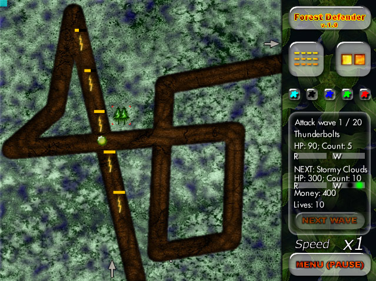

# Forest Defender

Java applet-based game. My favorite, really good, but a pain to get to run in a browser due to some security restrictions on applets. The library I used to write this game with has dies since. This project is as dead as a doornail but the game is still very much fun to play.



I am not willing to spend my time fixing the ant build shit:
  delete all inside build/applet, if exists
  install ant, if required


```bash
  brew install ant
  ant compile
  mkdir -p build/applet/temp/jar
  ant jar
  ant build-and-run
```


